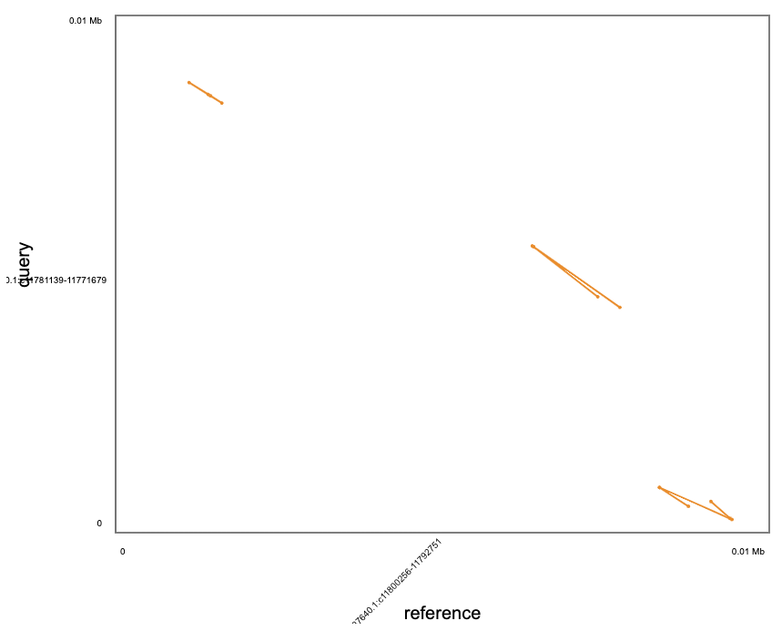

# CSD_project

An attempt to find CSD genes in other hymenopterans using the only reference (_Apis melifera_).


| Latin             | Common              | NCBI         | From?                      |
| ----------------- | ------------------- | ------------ | -------------------------- |
| Apis mellifera    | Honey Bee           | Amel_HAv3.1  | Uppsala University         |
| Osmia bicornis    | Red Mason Bee       | iOsmBic2.1   | DTOL                       |
| Nomada fabriciana | Fabricus' Nomad Bee | iyNomFabr1   | DTOL                       |
| Apis laboriosa    | Himalayan Honeybee  | ASM1406632v1 | Shangri-la                 |
| Exoneura robusta  | Bee...              | ASM1945341v1 | Uni of new Hampsire        |
| Apis florea       | Little Honeybee     | Aflo_1.1     | Baylor college of Medicine |
|                   |                     |              |                            |

Apologies for the unordered table.

Starting with these 6 assemblies, I expect at least the two other _Apis sp._ will contain a close match to the _A. mellifera_ csd gene. The others I hope are closely enough related that there would be some degree of a match.

## Notes
It is noted that it seems as though a similar experiment was performed by [Schmieder, Colinet and Poirie](https://www.ncbi.nlm.nih.gov/pmc/articles/PMC3621418/)

The above note that the _csd_ gene is a neofunctional duplication of the _fem_ gene (feminiser). So these will both be used for comparisons.

---
# Original Workflow
<details>

## 1 - Download the assemblies from NCBI

Self-explanatory

## 2 - Convert to protein and align
As a protein sequence would be more conserved than the DNA nucleotide sequence, thanks to the redundancy of codons, the above assemblies will be converted to protein sequence.

Using Prommer we can convert to protein and align, with the caveat that it is more computationally intensive than just using the DNA nucleotide sequence. But this is also not multi-threaded

### csd
```bash
for i in ../fasta/*.fasta;
    do prefix="../fasta/";
    j=${i#"$prefix"};
    echo "Running for: CSD + ${j}";
    bsub -q long -o out.txt -e error.txt -M 12000 -R "select[mem > 12000] rusage[mem=12000]" -M12000 /software/grit/tools/nummer323/MUMmer3.23/promer --mum -p CSD-${j} ../fasta/apis-ref-csd.fasta ${i};
done
```
### fem
```bash
for i in ../fasta/*.fasta;
    do prefix="../fasta/";
    j=${i#"$prefix"};
    echo "Running for: CSD + ${j}";
    bsub -q long -o out.txt -e error.txt -M 12000 -R "select[mem > 12000] rusage[mem=12000]" -M12000 /software/grit/tools/nummer323/MUMmer3.23/promer --mum -p FEM-${j} ../fasta/apis-ref-fem.fasta ${i};
done
```

Each job took ~80 seconds so not too intensive.

## 3 - Convert output to Dot style

```bash
suffix=".delta"
for i in *.delta;
	do echo "Running for: ${i}";
	j=${i#"$suffix"}
	/software/grit/bin/DotPrep.py --delta ${i} --out ../dot/${j}
done
```

```bash
suffix=".delta"
for i in *.delta;
	do echo "Running for: ${i}";
	j=${i#"$suffix"}
	/software/grit/bin/DotPrep.py --delta ${i} --out ../fem-dot/${j}
done
```

## 4 - Visualise in Dot

This resulted in minimal alignments. The best being between the _fem_ and _csd_ gene which makes sense as _csd_ is a neofunctional dupe of _fem_, but even this alignment was very minimal.



Oddly enough, the reference csd taken from _A. mellifera_ didn't align at all. Perhaps Dot is too simple a tool?

</details>

---

# New Workflow
This is now version 4 of my original plan.

Using Biopython, i've converted the genomic fasta to pep. This will not be perfect but should help indicate whether there is merit to the project.

```bash
for i in fasta/*.fasta; do 
    python3 scripts/convert.py ${i} ./pep/;
done
```

Take genomic protein fasta and use with a BLASTP search.

_Tiphia sp._ will act as a Negative control as csd is expected to only be in the Apodiae, which _Tiphia sp._ is not. It is likely that _Tiphia sp_ use a ml-CSD.

_Apis mellifera_ will be the positive control, as it contains the reference CSD

_Bombus sp._, _Apis sp._ will be screened


## Further investigations

- [ ] Using HMM to identify the domains in the Apodiae assemblies